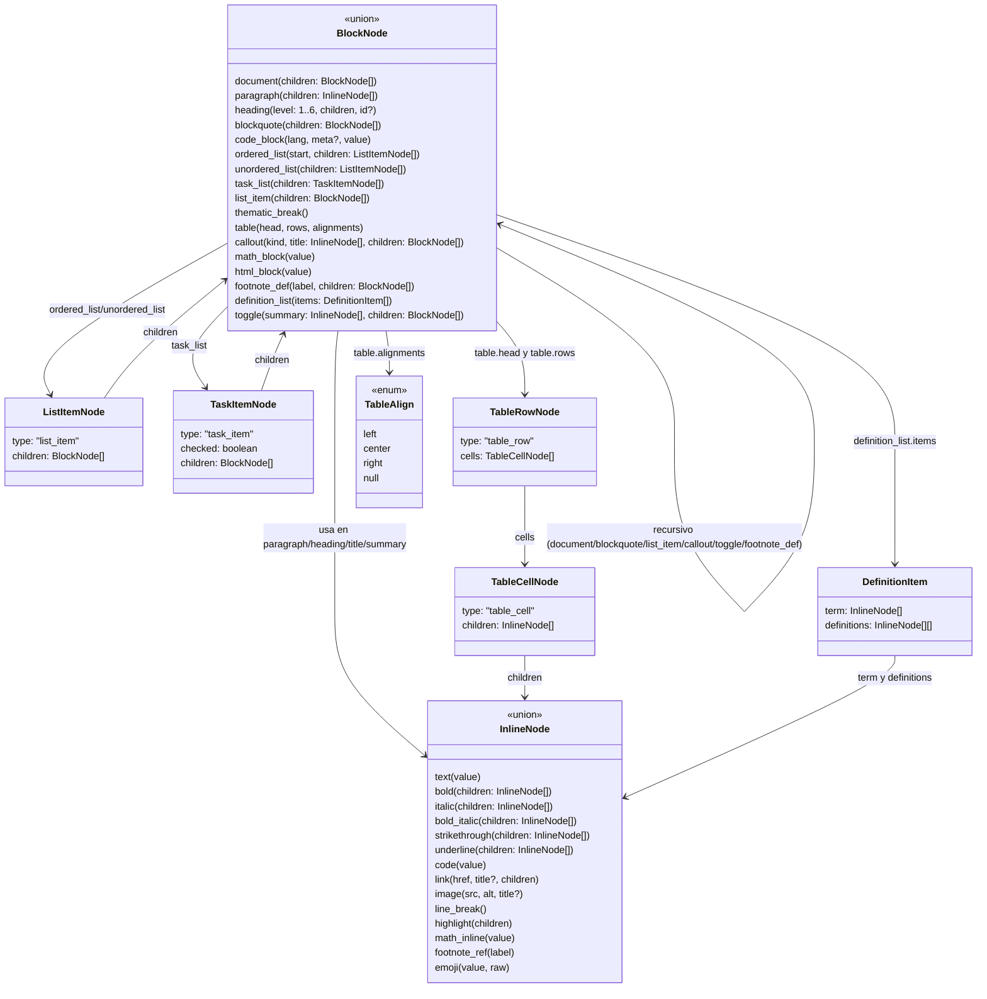

# Markdown engine project

```mermaid
classDiagram
direction TB

class InlineNode {
  <<union>>
  text(value)
  bold(children: InlineNode[])
  italic(children: InlineNode[])
  bold_italic(children: InlineNode[])
  strikethrough(children: InlineNode[])
  underline(children: InlineNode[])
  code(value)
  link(href, title?, children)
  image(src, alt, title?)
  line_break()
  highlight(children)
  math_inline(value)
  footnote_ref(label)
  emoji(value, raw)
}

class BlockNode {
  <<union>>
  document(children: BlockNode[])
  paragraph(children: InlineNode[])
  heading(level: 1..6, children, id?)
  blockquote(children: BlockNode[])
  code_block(lang, meta?, value)
  ordered_list(start, children: ListItemNode[])
  unordered_list(children: ListItemNode[])
  task_list(children: TaskItemNode[])
  list_item(children: BlockNode[])
  thematic_break()
  table(head, rows, alignments)
  callout(kind, title: InlineNode[], children: BlockNode[])
  math_block(value)
  html_block(value)
  footnote_def(label, children: BlockNode[])
  definition_list(items: DefinitionItem[])
  toggle(summary: InlineNode[], children: BlockNode[])
}

class ListItemNode {
  type: "list_item"
  children: BlockNode[]
}

class TaskItemNode {
  type: "task_item"
  checked: boolean
  children: BlockNode[]
}

class TableRowNode {
  type: "table_row"
  cells: TableCellNode[]
}

class TableCellNode {
  type: "table_cell"
  children: InlineNode[]
}

class DefinitionItem {
  term: InlineNode[]
  definitions: InlineNode[][]
}

class TableAlign {
  <<enum>>
  left
  center
  right
  null
}

BlockNode --> InlineNode : usa en paragraph/heading/title/summary
BlockNode --> BlockNode : recursivo (document/blockquote/list_item/callout/toggle/footnote_def)
BlockNode --> ListItemNode : ordered_list/unordered_list
BlockNode --> TaskItemNode : task_list
BlockNode --> TableRowNode : table.head y table.rows
TableRowNode --> TableCellNode : cells
TableCellNode --> InlineNode : children
BlockNode --> DefinitionItem : definition_list.items
DefinitionItem --> InlineNode : term y definitions
BlockNode --> TableAlign : table.alignments
ListItemNode --> BlockNode : children
TaskItemNode --> BlockNode : children
```